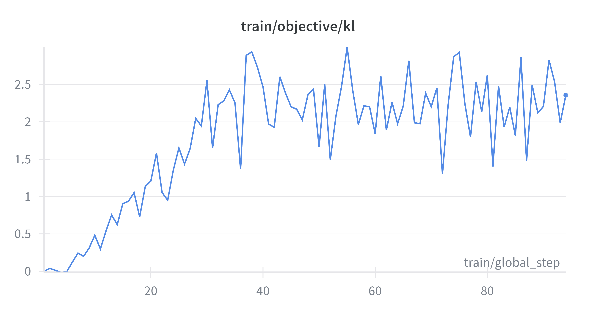
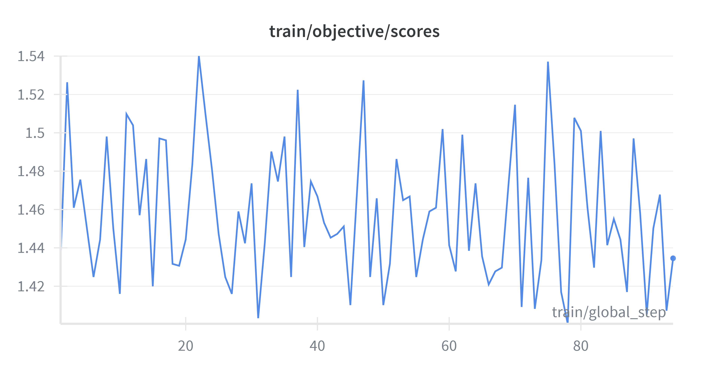

## Introduction

## 1. Understanding and Utilizing Causal Transformers

### 1.1 Introduction to transformers

Transformer models, introduced by Vaswani et al. (2017), constitute a breakthrough in sequence modeling. First, they were proposed for machine translation, but Transformers have become the standarts in natural language processing (NLP), speech processing, computer vision and time series analysis.

Unlike recurrent neural networks (RNNs) or long short-term memory networks (LSTMs), Transformers do not process sequences sequentially. They rely on a self-attention mechanism that allows each element of a sequence to directly attend to all other elements in parallel. This design enables more efficient training, better handling of long-range dependencies.

### 1.2 Causal transformers

Causal Transformers constitute a specific class of Transformers designed for autoregressive tasks, i.e. modeling a sequence by predicting each element conditionally on on the previously predicted elements. They are particularly well-suited for generative tasks, such as text generation, where outputs must be produced sequentially and depend only on past information. 
This causal constraint is essential for modeling natural language as a sequential stochastic process and directly determines both the training objective and the inference procedure. Two well-known examples are GPT and LLaMA.

Architecturally, Causal Transformers are based on a decoder-only design, combining masked self-attention, feedforward layers, and positional encodings to learn high-dimensional representations of token sequences.

Let $(x_1, x_2, \dots, x_T)$ denote a sequence of discrete tokens drawn from a vocabulary $\mathcal{V}$.  
A Causal Transformer models the joint probability of the sequence using an autoregressive factorization:

$$
P(x_1, \dots, x_T)
= \prod_{t=1}^{T} P(x_t \mid x_1, \dots, x_{t-1})
$$

This formulation defines the Causal Language Modeling objective.

#### Causal self-attention

Given an input embedding matrix $X \in \mathbb{R}^{T \times d}$, linear projections produce queries $Q$, keys $K$, and values $V$:

$$
Q = X W_Q, \quad
K = X W_K, \quad
V = X W_V
$$

The self-attention operation is defined as:

$$
\text{Attention}(Q, K, V)
= \text{softmax}\left( \frac{Q K^\top}{\sqrt{d_k}} + M \right) V
$$

where $M \in \mathbb{R}^{T \times T}$ is a causal mask such that:

$$
M_{ij} =
\begin{cases}
0 & \text{if } j \le i \\
-\infty & \text{if } j > i
\end{cases}
$$

This mask ensures that the representation at position $i$ depends only on tokens  
$(x_1, \dots, x_i)$.

#### Training objective

The parameters $\theta$ of the model are learned by minimizing the negative log-likelihood of the observed sequence:

$$
\mathcal{L}(\theta)
= - \sum_{t=1}^{T} \log P_\theta(x_t \mid x_1, \dots, x_{t-1})
$$

In practice, this loss is implemented as a cross-entropy loss between the predicted token distribution and the true next token.  
The training procedure is self-supervised, as the targets are derived directly from the input data.

Causal Transformers rely on a decoder-only architecture and generate sequences in an autoregressive manner, where each token is predicted conditionally on previously generated tokens, mirroring the probabilistic structure learned during training. The use of causal self-attention enforces this temporal constraint, while positional encodings such as learned embeddings or rotary positional embeddings allow the model to capture token order and long-range dependencies. These models scale efficiently with increased depth, width, and training data due to parameter sharing across sequence positions. However, their autoregressive inference and the quadratic complexity of self-attention introduce limitations in terms of generation latency and long-context efficiency.

## 2. Implementing the RLHF Pipeline

This project implements Reinforcement Learning from Human Feedback (RLHF) to fine-tune a GPT-2 model on the Stanford Human Preferences Dataset (SHP) (https://huggingface.co/datasets/stanfordnlp/SHP). It is dataset of 385K collective human preferences over responses in different subject areas. The preferences are meant to reflect the helpfulness of one response over another, and are intended to be used for training RLHF reward models. 

The objective is to align the model’s responses with human preferences for helpfulness, honesty, and harmlessness. The pipeline consists of a preprocessing of the dataset step and two main stages: training a Reward Model to act as human judgment, and optimizing the base LLM using Proximal Policy Optimization.

_Figure 1: RLHF pipeline from Stiennon (2022)_

**Data preparation** 

The raw dataset from SHP is not  binarized. It contains a question (the "history" or "prompt") and a list of multiple human answers, each with a specific score based on community upvotes. Firstly, we transformed these answers into pairs. For every question, we selected a "chosen" answer (higher score) and a "rejected" answer (lower score).

Secondly, we formatted the data into a structure compatible with the Hugging Face _RewardTrainer_. Through this tokenization process, the dataset was transformed into the columns _input_ids_chosen_/_attention_mask_chosen_ for the preferred responses and _input_ids_rejected_ _attention_mask_rejected_ for the non-preferred alternatives.

Finally, to manage computational limitations and ensure stable training on GPT-2, we implemented a filtering process: 
- We keep only data from the sub-reddit _explainlikeImfive_ which is a domain where people ask general questions to get an easily understandable answer. 
- Token Limit: We removed any responses exceeding 256 tokens. This prevents Out-of-Memory errors. There was 13,123 samples under 256 tokens.
- Subsampling for Efficiency: To optimize training time while maintaining a valid  pipeline, we utilized the following subsets:
  - Reward Model: 1,000 training pairs | 200 evaluation pairs.
  - PPO Optimization: 1,000 training prompts | 200 evaluation prompts.

## 3. Training a Reward Model

To align the language model with human preferences, we trained a Reward Model on the Stanford Human Preferences dataset. This model learns to assign higher scores to responses that humans prefer over alternative responses. The Reward Model a pre-trained GPT-2 that is transformed from a text generator into a regression model

The Reward Model provides the feedback the model needs to improve during the PPO phase. The final model uses these scores to learn which answers are better suited for moving from generic responses to preferred ones.

**Results**

The Training Loss showed a promising downward trend, it dropped from 2.49 at step 50 to 0.52 by step 750. However, the Validation Loss struggled to decrease below 0.71. 
The model shows an accuracy of 47.00%. This indicates the model  fails to differentiate between the chosen and rejected text pairs. It is a sign that the model is struggling with the noise in the dataset. The near random accuracy suggests that a larger training subset (beyond 1,000 samples) and additional epochs may be required to capture the nuances of responses (it was not implemented due to computational resources). 

## 4. Optimization with Proximal Policy Optimization (PPO)

Then, we used our trained Reward Model to fine-tune the GPT-2 policy through reinforcement learning. The goal is to generate better outputs that align with human preferences. In this setup, the Reward Model provides a  score for every response the model produces. By using the PPO (Proximal Policy Optimization) algorithm, we optimized the model to maximize these reward scores.

**The PPO Objective**

The model maximizes:

$$J(\theta) = \mathbb{E}_{(x, y) \sim \pi_{\theta}} \left[ r_{\phi}(x, y) - \beta \text{KL} \left( \pi_{\theta}(y \mid x) \parallel \pi_{\text{ref}}(y \mid x) \right) \right]$$

Where:
- $r_\phi(x, y)$ is the scalar score from the Reward Model.
* $\text{KL}(\cdot)$ is the Kullback-Leibler (KL) divergence.
* $\beta$ is a hyperparameter that controls the KL penalty.

We began with an initial LLM (GPT-2), that generates responses to prompts in the training dataset, for each response the Reward Model gives a score and we fine-tune the model to align its outputs with human preferences. To prevent generating nonsensical text, PPO applies a KL Divergence penalty, which measures how much the updated policy differs from the original model.

**Results**

<ins>KL Divergence:<ins> 

The increase in KL divergence shows that the model moved away from the base weights to adopt the new preferences. Moreover, staying around 2.35 suggests that the model learned new behaviors without collapsing or becoming too incoherent.

_Figure 2: Evolution of the KL divergence on the training set_

<ins>Scores:<ins> 

The stability of the reward score shows that the PPO process preserved the "quality gains" from the Reward Model while the policy was being optimized. 

_Figure 2: Evolution of the Reward score on the training set_

**Generated outputs**

<ins>Example 1:<ins> 

PROMPT: "The best way to learn something new is"

BASE MODEL: "...to create a list of things you wicll like about yourself. In this example, I am writing my life story"

RLHF PPO: "...to get as much practice in it. You'll find that you will be able to do so by working with your own personal trainer"

The Base Model fails to address the prompt's intent, drifting into an irrelevant narrative about writing a life story. In contrast, the RLHF PPO model identifies the context of the prompt and provides practical content. While the second half of the PPO output remains  generic, it demonstrates a shift based on the "how-to" style on which the Reward Model was trained.

<ins>Example 2:<ins>

PROMPT: "A great way to spend a weekend is"

BASE MODEL: "...to visit the beach, or on one of those popular beaches. The main difference between that and being in Miami Beach for an entire day may not"

RLHF PPO: "...to have some fun with your friends, get on the right side of things and watch TV. That's exactly what we did for this week!"

In this instance, the Base Model starts on the topic but loses coherence at the end. The RLHF PPO model produces a much more natural and human-like response. It frames the answer as a true suggestion and concludes with a complete sentence. This shows that the PPO training helped the model move away from repetitive answers to an "human" style writing from Reddit. 

## Conclusion

This project demonstrates the implementation of a functional RLHF pipeline by improving a GPT-2 model with human preferences using the ELI5 dataset. The integration of a Reward Model and Proximal Policy Optimization (PPO), we observe a small shift from generic text completion to more contextually relevant outputs. However, the project was constrained by computational limitations, which necessitated restricted sequence lengths and a small training subset of 1,000 samples. These constraints contribute to a Reward Model accuracy that remained low. Future work should focus on scaling the training data and utilizing larger transformer architectures, to enhance the capabilities of the model. 

## References

- Bai, Y., et al. (2022). Training a Helpful and Harmless Assistant with
Reinforcement Learning from Human Feedback. https://arxiv.org/abs/2204.05862v1
- Ethayarajh, K., et al. (2022). Understanding Dataset Difficulty with $V$ Usable Information. https://proceedings.mlr.press/v162/ethayarajh22a/ethayarajh22a.pdf
- Schulman, J., et al. (2017). Proximal Policy Optimization Algorithms. https://arxiv.org/abs/1707.06347v2
- Stiennon, N.n et al. (2022).  Learning to summarize from human feedback. https://arxiv.org/pdf/2009.01325v3
- Vaswani, A., et al. (2017). Attention Is All You Need. https://arxiv.org/abs/1706.03762v7

- Hugging Face. Causal language modeling. https://huggingface.co/docs/transformers/en/tasks/language_modeling
- Hugging Face. TRL Quickstart Guide. https://huggingface.co/docs/trl/quickstart#minimal-example

 

